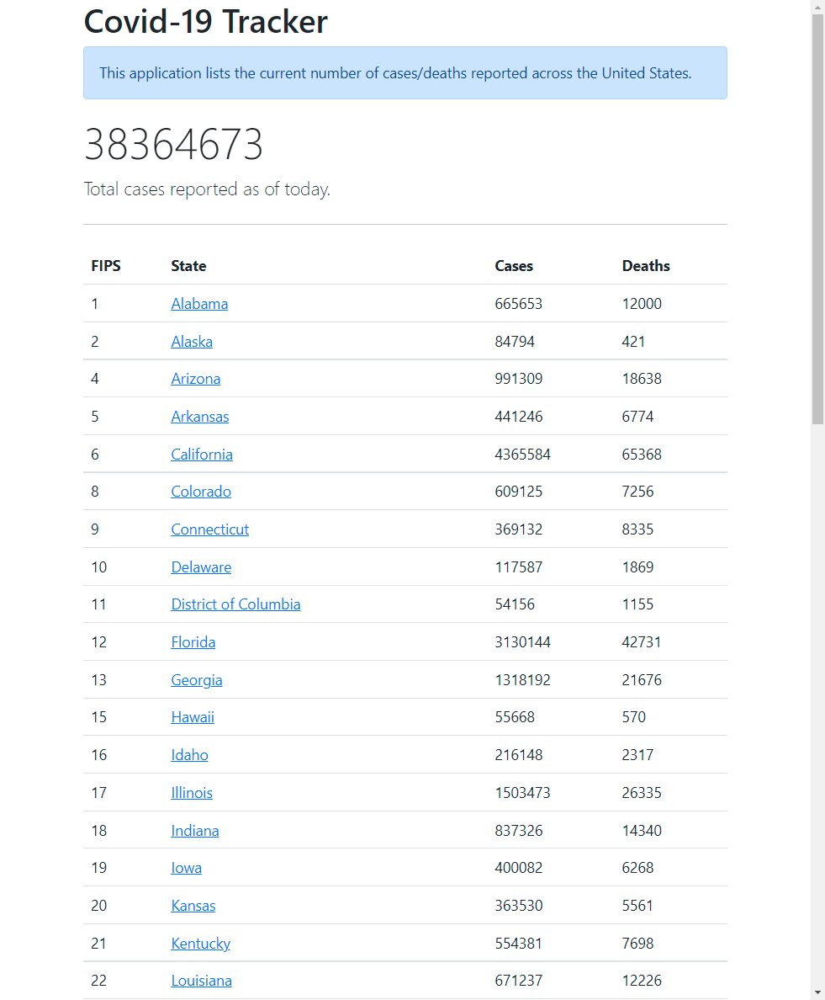
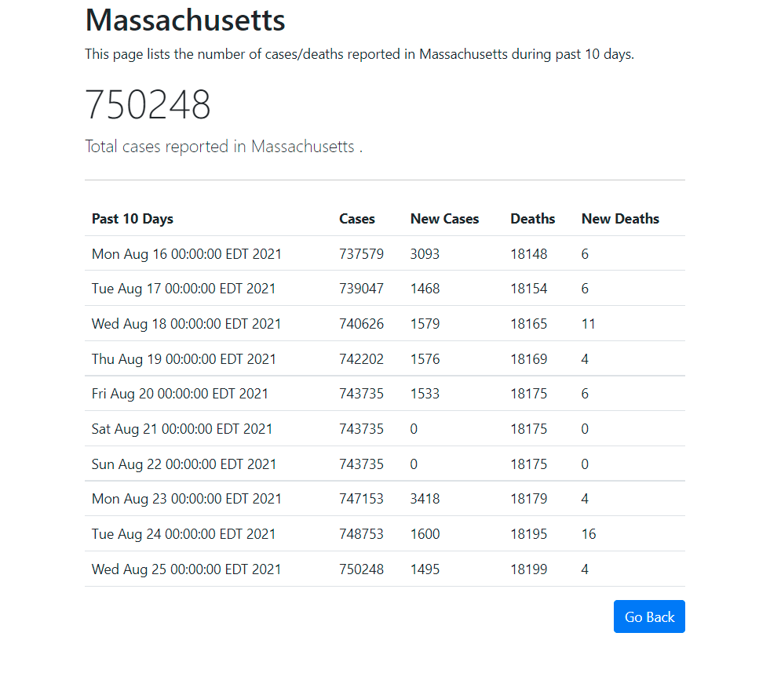

# Covid-19 Tracker

---

This app display up-to-date Covid-19 data of different states.

Home           |  Home/{FIPS}/latest
:-------------------------:|:-------------------------:
  |  

Raw data from The New York Times. [Link](https://github.com/nytimes/covid-19-data)

## Installation

---

Clone the Service

## Run the App

---

With Maven and Java installed
run `mvn spring-boot:run`

## View Page

---
With application running, go to [http://localhost:{port=8080}](http://localhost:8080)

